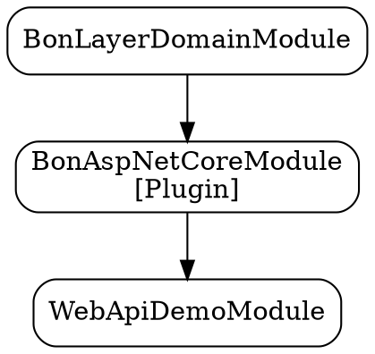

# Module Dependency Graph Visualization

## Overview

The Bonyan Modularity System now includes comprehensive graph visualization capabilities for module dependencies. This helps developers understand the module loading order, dependency relationships, and troubleshoot issues.

## Features

### 1. Tree Visualization
Shows the dependency graph as a hierarchical tree structure with ASCII art:

```
Module Dependency Graph:
============================================================
BonAspNetCoreModule (depends on: BonLayerDomainModule)
└── WebApiDemoModule
```

### 2. Load Order Visualization
Displays modules in their initialization sequence with step numbers:

```
Module Load Order:
============================================================
01. BonAspNetCoreModule
    └─ Requires: BonLayerDomainModule
02. WebApiDemoModule
    └─ Requires: BonAspNetCoreModule
```

### 3. DOT Graph Format
Generates Graphviz DOT format for external visualization tools:



### 4. Dependency Matrix
Shows a matrix view of all module dependencies:

```
Module Dependency Matrix:
================================================================================
                    BonAspNetCoreModule  WebApiDemoModule
BonAspNetCoreModule .                   .
WebApiDemoModule    X                   .
```

## Usage

### Automatic Logging

The graph visualization is automatically logged during module loading:

- **Information Level**: Load order and tree visualization
- **Debug Level**: Detailed dependency tree
- **Trace Level**: DOT graph format (for external tools)

### Programmatic Access

You can also generate visualizations programmatically:

```csharp
// Generate tree visualization
var tree = ModuleGraphVisualizer.GenerateTreeVisualization(modules, rootModuleType);
Console.WriteLine(tree);

// Generate load order
var loadOrder = ModuleGraphVisualizer.GenerateLoadOrderVisualization(sortedModules);
Console.WriteLine(loadOrder);

// Generate DOT graph for Graphviz
var dotGraph = ModuleGraphVisualizer.GenerateDotGraph(modules);
File.WriteAllText("module-graph.dot", dotGraph);

// Generate dependency matrix
var matrix = ModuleGraphVisualizer.GenerateDependencyMatrix(modules);
Console.WriteLine(matrix);
```

## Example Output

When running your application, you'll see output like:

```
info: Bonyan.Modularity.BonModuleLoader[0]
      Module loading completed: 2 modules loaded in dependency order
info: Bonyan.Modularity.BonModuleLoader[0]
      Module dependency graph:
      Module Dependency Graph:
      ============================================================
      BonAspNetCoreModule (depends on: BonLayerDomainModule)
      └── WebApiDemoModule

info: Bonyan.Modularity.DependencyGraphBuilder[0]
      Load order:
      Module Load Order:
      ============================================================
      01. BonAspNetCoreModule
          └─ Requires: BonLayerDomainModule
      02. WebApiDemoModule
          └─ Requires: BonAspNetCoreModule
```

## Visualizing with Graphviz

To create a visual graph from the DOT format:

1. Enable Trace logging to capture the DOT graph
2. Copy the DOT graph output
3. Save to a `.dot` file
4. Use Graphviz to render:

```bash
dot -Tpng module-graph.dot -o module-graph.png
dot -Tsvg module-graph.dot -o module-graph.svg
```

## Benefits

1. **Clear Dependency Understanding**: See exactly which modules depend on which
2. **Load Order Verification**: Verify modules load in the correct sequence
3. **Troubleshooting**: Quickly identify missing dependencies or circular references
4. **Documentation**: Generate visual documentation of your module architecture
5. **Debugging**: Better insights during development and debugging

## Notes

- Plugin modules are marked with `[Plugin]` in visualizations
- The tree visualization shows reverse dependencies (what depends on what)
- The load order shows the topological sort result (initialization sequence)
- All visualizations are generated at runtime and logged automatically

